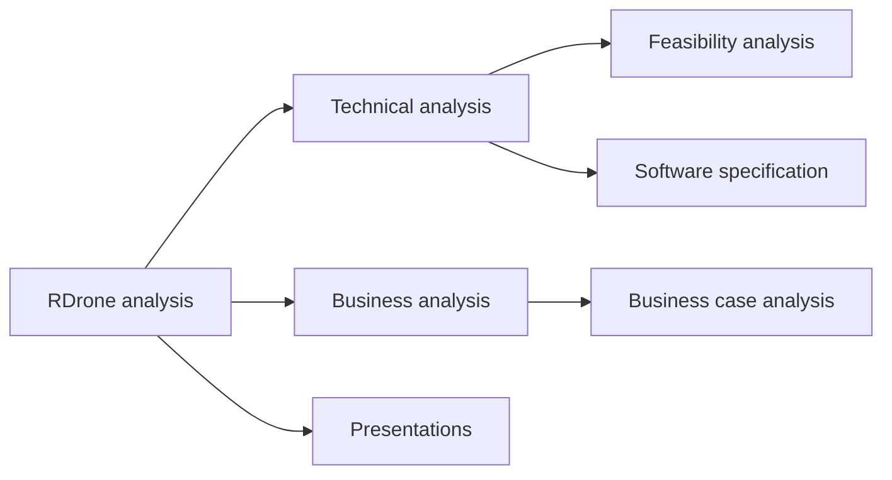

# RDrone-business-analysis

## Introduction

The rescue actions in a disaster zone starts with a wide area assessment, creating sectors, a worksite triage and a rapid search rescue followed by a full search and rescue. An automated life detection in the disaster zone using drones and radars to scan large areas in a rapid manner and shorten the rescue time. The Ultra-Wideband Frequency can penetrate debris to detect life signals (breathing and movement) while video can detect people on the surface – both enabled with state-of-the-art algorithms. The proposed solution comprise of:
- detection agent:
  - VTOL (vertical takeoff and landing) drone,
  - sensors (UWB radar, camera, thermal imaging),
  - detection algorithms (using convolution neural network, independent component analysis and Fast-Fourier Transform algorithm).
- control station for rescuers (on dedicated controller):
  - controlling the flight and scanning of the agent by satellite communication,
  - GPS navigation,
  - live video streaming,
  - survivors detection alerts and localization,
  - area inspection and highlighting dangerous sectors.

## Structure

The performed analyses concern different aspects of product's lifecycle and busineess areas. They were divided into catalogs respectively as represented in the graph below.

## Tools
As the project is strictly for demonstration and learning, the list of the tools and skills is provided:
1. Google suite (Docs, Slides, Sheets)
2. PowerBI
3. 
